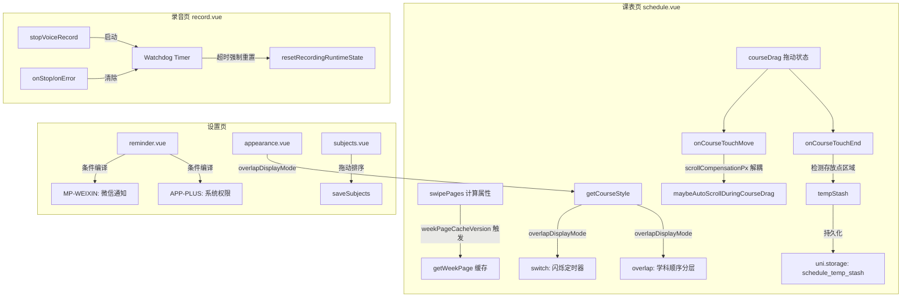

## 用户需求

### Bug 修复

1. **长按拖动课程后重合未刷新**：长按课A移动到已有课B的位置后，两节课重合时课表信息未刷新，移动前位置仍显示课A，需切换周数才恢复正常。
2. **向下拖动页面抖动卡顿**：长按拖动课程时向左/右/上均正常，但向下拖动会出现页面剧烈抖动和卡顿。
3. **录音卡在"录音处理中"**：录音有时会卡在"录音处理中，请稍候"状态无法恢复，需新增超时检测机制，超时时间 = 录音时长 × 2，超时自动销毁本次录音任务进程，保证下次录音正常。

### 功能变更

4. **删除拖动到边缘切换周数功能**：移除"拖到课表边缘自动切换周数"的交互。改为在课表左下角新增**临时存放点**：

- 拖动课程时可放入存放点，支持放入多节课
- 点击存放点横向展开，可左右滚动查看放入的课程
- 长按存放点中的课程可拖出（同时收起存放点），放回课表任意位置
- 存放点仅在"内部有课"或"手里正拖着课"时显示
- 持久化保留（离开页面再回来仍在）

5. **提醒设置平台适配**：微信服务通知仅在微信小程序端显示；APP端改为显示"系统通知权限状态"（显示权限已开启/未开启 + "去开启"按钮，调用系统权限请求）；测试提醒通知中的"测试小程序"按钮仅在微信小程序端显示。
6. **提醒时间按模式显示**：智能提醒时间设置仅在用户选择"智能提醒"后显示；传统提醒时间（默认提醒时间）设置仅在用户选择"传统提醒"后显示。
7. **课表重叠显示模式**：两节课重叠时支持手动选择"切换显示"（默认，现有轮播闪烁逻辑）和"重叠显示"（按学科管理-学科列表顺序作为图层顺序，第1个学科在最上层最不透明，越靠后越透明）。同时可设置：最低透明度（默认10%）、切换频率（默认2s）。
8. **学科列表拖动排序**：学科管理页面每个学科左侧新增拖动图标（`/static/move.png`，使用相对路径），拖动该图标可调整学科顺序。

## 技术栈

- uni-app (Vue3 Options API) + 微信小程序/APP双端条件编译
- 本地存储：`uni.getStorageSync` / `uni.setStorageSync`
- 样式：rpx 单位 + 内联 style 动态计算
- 图标资源：`/static/move.png`（已存在）

## 实现方案

### 1. Bug: 重合课表未刷新

**根因**：`__weekPageCache` 在 `mounted()` 中赋值（`this.__weekPageCache = {}`），非响应式。`swipePages` 计算属性调用 `getWeekPage()`，缓存命中时不访问 `this.courses`，Vue 无法追踪依赖。`applyScheduleCourses` 清空缓存后，因 `__weekPageCache` 非响应式，`swipePages` 不会重新求值。

**修复**：在 `data()` 中新增响应式属性 `weekPageCacheVersion: 0`，`invalidateWeekPageCache()` 中递增该值，`swipePages` 计算属性中引用 `this.weekPageCacheVersion` 确保依赖追踪。同周移动后即使 `selectedWeek` 不变也能触发重算。

### 2. Bug: 向下拖抖动

**根因**：`maybeAutoScrollDuringCourseDrag()` 向下滚动时修改 `courseDrag.startY`（`startY: drag.startY - deltaPeriod * drag.cellPx`），而 `onCourseTouchMove` 每帧用 `touch.clientY - this.courseDrag.startY` 重算 `dy`，形成反馈环路：滚动→修改startY→dy变化→ghost位置跳变→下一帧再次触发滚动。

**修复**：在 `courseDrag` 状态中新增 `scrollCompensationPx: 0` 字段记录累计滚动补偿。自动滚动时将 `deltaPeriod * cellPx` 累加到 `scrollCompensationPx` 而非修改 `startY`。`onCourseTouchMove` 中有效 `dy = touch.clientY - startY + scrollCompensationPx`。`courseDragGhostStyle()` 中 `top` 计算也纳入 `scrollCompensationPx`。彻底解耦滚动补偿与原始触摸坐标。

### 3. 临时存放点

**删除**：`maybeSwitchWeekDuringCourseDrag`、`beginCourseDragWeekSwitch`、`previewWeekSwitchDuringCourseDrag`、`afterCourseDragWeekPreview`、`clearCourseDragWeekSwitch` 方法及关联 data 字段（`courseDragWeekSwitchTimer`、`courseDragWeekSwitching`、`courseDragWeekSwitchDelay`、`courseDragWeekSwitchAnimationMs`、`courseDrag.edgeSwitchingAt`、`courseDrag.edgeSwitchDirection`）。从 `startCourseDragAutoScroll` 的 16ms 定时器中移除 `maybeSwitchWeekDuringCourseDrag` 调用。

**新增**：

- Data：`tempStash: []`（存 `{ course, originWeek }` 对象数组）、`tempStashExpanded: false`
- 持久化键 `schedule_temp_stash`，`refresh()` 时加载，变更时保存
- 显示条件：`tempStash.length > 0 || (courseDrag && courseDrag.active)`
- 模板：fixed 定位左下角，收起态为圆形图标 + 数量角标；展开态为 `scroll-view scroll-x` 横向排列课程芯片
- 拖入：`onCourseTouchEnd` 中检测 ghost 是否在存放点区域（左下角坐标范围），若是则从课程列表移除该课、push 到 `tempStash`、持久化
- 拖出：存放点芯片 `@touchstart` 长按 400ms 后启动 `courseDrag`（复用现有拖动机制，`course` 来自 stash 项），拖出后 `onCourseTouchEnd` 将课程放回目标周/天/节，从 `tempStash` 移除，收起存放点

### 4. 提醒设置平台适配

**reminder.vue 模板**：

- "微信服务通知" cell 用 `<!-- #ifdef MP-WEIXIN -->` 包裹
- 新增 APP 专属 cell（`<!-- #ifdef APP-PLUS -->`）：标题"系统通知权限"，显示权限状态文本 + "去开启"按钮（调用 `requestNotificationPermission`）
- "测试小程序"按钮用 `<!-- #ifdef MP-WEIXIN -->` 包裹
- 测试通知 cell 描述文案调整：APP端仅提及安卓本地通知

**notification.js**：

- 新增 `getSystemNotificationPermissionStatus()`：APP端通过 `plus.android` 查询 `NotificationManagerCompat.areNotificationsEnabled()` 获取真实系统权限状态；小程序端回退到存储布尔值

### 5. 提醒时间按模式显示

- 智能提醒时间 cell 添加 `v-if="reminderMode === smartMode"`
- 默认提醒时间 cell 添加 `v-if="reminderMode === traditionalMode"`
- 调整卡片分组：提醒模式 cell 独立卡片；智能提醒时间仅在智能模式时出现在同卡片；默认提醒时间仅在传统模式时出现

### 6. 重叠显示模式

**schedule.js**：

- `DEFAULT_APPEARANCE` 新增：`overlapDisplayMode: 'switch'`、`overlapMinOpacity: 0.1`、`overlapSwitchFrequency: 2000`
- `mergeAppearance` 扩展校验逻辑
- 兼容：`overlapBlinkCycleMs` 仍保留但优先使用 `overlapSwitchFrequency`

**schedule.vue**：

- `getCourseStyle` 中重叠分支：
- `overlapDisplayMode === 'overlap'`：按学科列表顺序获取组内索引，opacity 线性插值 `cardOpacity * (1 - idx/(n-1) * (1 - minOpacity))`，第1个最不透明，最后一个 = `cardOpacity * minOpacity`，所有课程同时可见
- `overlapDisplayMode === 'switch'`：复用 `computeOverlapAlpha` 但 cycle 改用 `overlapSwitchFrequency`，fade 阶段最低 alpha 改为 `overlapMinOpacity` 而非 0
- 导入 `loadSubjects` 获取学科顺序映射

**appearance.vue**：

- 新增"重叠显示模式"选择器（切换显示 / 重叠显示）
- "最低透明度"slider（10%-100%，步进5%）
- "切换频率"slider（1s-10s，步进0.5s），仅切换模式显示
- 现有"重叠课程切换时长"slider 重命名为"切换频率"并绑定 `overlapSwitchFrequency`

### 7. 学科拖动排序

**subjects.vue**：

- 每个 `subject-item` 左侧新增 `<image class="drag-handle" src="/static/move.png" mode="aspectFit">` 
- 拖动实现：
- `onSubjectHandleTouchStart(index, e)`：记录 `dragIndex` 和起始 Y 坐标，设 400ms 长按定时器
- 长按激活后进入拖动态：`subjectDrag.active = true`，被拖项添加 `dragging` 样式类（scale + shadow）
- `onSubjectHandleTouchMove(e)`：根据 `clientY` 计算目标索引，若与 `dragIndex` 不同则 `splice` 交换数组
- `onSubjectHandleTouchEnd()`：保存 `saveSubjects()`，重置拖动态
- 拖动期间 `scroll-view` 滚动到可视区域（若拖到边缘）

### 8. 录音超时检测

**record.vue**：

- Data 新增 `recordWatchdogTimer: null`
- `stopVoiceRecord()` 中 `recorderManager.stop()` 调用后启动看门狗：

```js
const elapsed = Date.now() - this.recordStartTime
const timeout = Math.max(elapsed * 2, 5000)
this.recordWatchdogTimer = setTimeout(() => {
if (this.isRecordStopping) {
this.resetRecordingRuntimeState('watchdog timeout')
this.resetRecordingUiState('watchdog timeout')
uni.showToast({ title: '录音处理超时，已重置', icon: 'none' })
}
}, timeout)
```

- `recorderManager.onStop` 和 `onError` 回调中清除看门狗
- `cancelVoiceRecord()` 同样启动看门狗
- `onUnload` 中清除看门狗定时器

## 实现注意事项

- **性能**：临时存放点拖入/拖出复用现有 `courseDrag` 机制，避免新增独立拖动系统；重叠"重叠显示"模式无定时器开销（静态渲染），优于切换模式的 50ms 定时器
- **向后兼容**：`overlapBlinkCycleMs` 保留但标记为废弃，`overlapSwitchFrequency` 优先；旧数据无 `overlapDisplayMode` 时默认 `'switch'`
- **条件编译**：APP 端通知权限检测使用 `plus.android` API 需包裹 `#ifdef APP-PLUS`；小程序端 `requestSubscribeMessage` 需包裹 `#ifdef MP-WEIXIN`
- **数据一致性**：临时存放点变更后立即 `uni.setStorageSync` 持久化，`onShow` 时重新加载避免多页数据不同步
- **抖动修复**：解耦 `scrollCompensationPx` 后需同步修改 `courseDragGhostStyle` 和 `onCourseTouchEnd` 中 dy 计算逻辑，确保 ghost 跟手位置正确

## 架构设计



## 目录结构

```
作业助手/
├── pages/
│   ├── schedule/
│   │   └── schedule.vue          # [MODIFY] 修复刷新bug(weekPageCacheVersion)、修复向下拖抖动(scrollCompensationPx)、删除边缘切周、新增临时存放点、重叠显示模式渲染
│   ├── settings/
│   │   ├── reminder/
│   │   │   └── reminder.vue      # [MODIFY] 平台条件编译(微信通知/系统权限/测试小程序)、提醒时间按模式v-if显示
│   │   ├── appearance/
│   │   │   └── appearance.vue    # [MODIFY] 新增重叠显示模式选择器、最低透明度slider、切换频率slider
│   │   └── subjects/
│   │       └── subjects.vue      # [MODIFY] 学科列表新增拖动图标+拖动排序逻辑
│   └── record/
│       └── record.vue            # [MODIFY] 录音超时看门狗机制
├── utils/
│   ├── schedule.js               # [MODIFY] DEFAULT_APPEARANCE新增overlapDisplayMode/overlapMinOpacity/overlapSwitchFrequency，mergeAppearance扩展
│   ├── notification.js           # [MODIFY] 新增getSystemNotificationPermissionStatus() APP端真实权限检测
│   └── subjects.js               # [MODIFY] 无结构变更，数组索引即为顺序（loadSubjects/saveSubjects已支持）
└── static/
    └── move.png                  # [EXIST] 拖动图标，已存在
```

## Agent Extensions

### SubAgent

- **code-explorer**
- Purpose: 在实现前深入搜索 schedule.vue 中所有引用 `maybeSwitchWeekDuringCourseDrag`、`beginCourseDragWeekSwitch`、`clearCourseDragWeekSwitch` 的位置，确保删除边缘切周功能时无遗漏调用点
- Expected outcome: 确认所有需要删除的代码位置和调用链，避免运行时报错